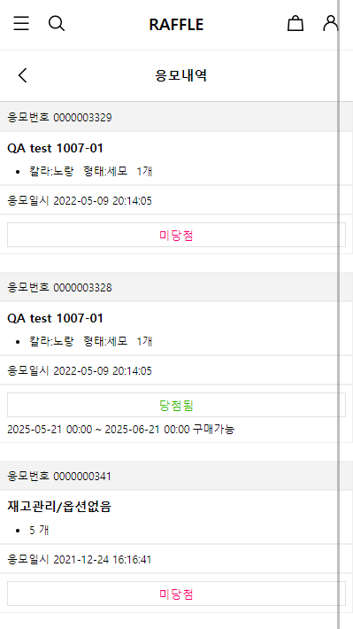

# 1. 응모내역 보기

### 소개

로그인한 회원이 자신의 응모내역을 볼 수 있는 API 입니다.\
간단한 html을 추가하는것만으로 사용하실 수 있습니다.

### 미리보기

| PC Style                                    | Mobile Style                      |
| ------------------------------------------- | --------------------------------- |
|  (1).png>) |  |

### 사용방법

응모내역을 표시하고 싶으신 페이지에 아래와 같은 코드를 추가만으로\
간편하게 사용하실 수 있습니다.\
\
**`list-style`**설정에 따라 PC와 Mobile 각각에 맞는 자동 스타일이 적용됩니다.


PC Style 응모내역

```markup
<div class="__raffle_list_wrap__" list-style="pc">
    응모내역을 불러오는중입니다.
</div>
```


Mobile Style 응모내역

```markup
<div class="__raffle_list_wrap__" list-style="mobile">
    응모내역을 불러오는중입니다.
</div>
```
